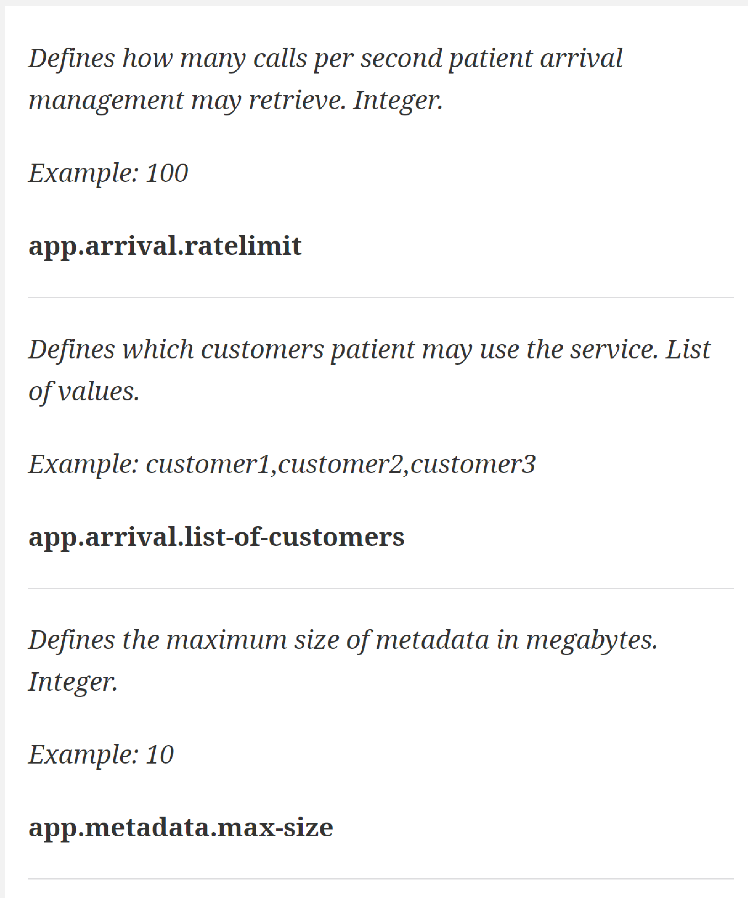

== Modulith demo project
_Shows the approaches with autodocumented, well-structured application based on Spring Modulith_

=== Updates the documentation automatically:

=== Describes components structure:

=== Generates documentation for spring modules and classes:

=== Describes configuration:
